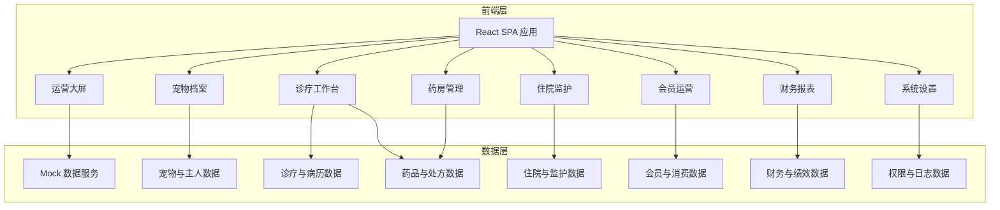
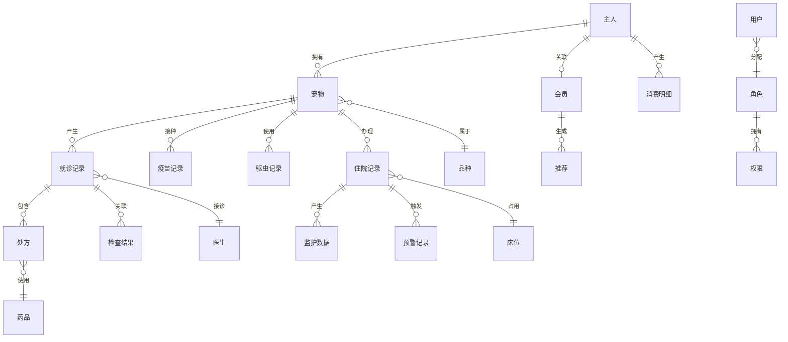

## 1. 架构设计



## 2. 技术说明

- **前端框架**：React@18 + TypeScript
- **样式方案**：Tailwind CSS@3
- **构建工具**：Vite
- **路由**：React Router@6
- **图表库**：Recharts（轻量级，React 原生支持）
- **状态管理**：Zustand（轻量、TypeScript 友好）
- **图标库**：Lucide React（线性图标，符合设计风格）
- **日期处理**：date-fns
- **后端**：无后端，使用 Mock 数据模拟全部业务逻辑
- **数据库**：无数据库，前端内存 + localStorage 持久化

## 3. 路由定义

| 路由 | 用途 |
|------|------|
| `/` | 重定向至运营大屏 |
| `/dashboard` | 运营大屏，核心指标与可视化 |
| `/archives` | 宠物档案管理，列表与搜索 |
| `/archives/new` | 新建宠物档案，分步表单 |
| `/archives/:id` | 档案详情，一宠一档全景视图 |
| `/diagnosis` | 诊疗工作台，预约挂号与病历 |
| `/diagnosis/:id` | 诊疗详情，电子病历与AI辅助 |
| `/pharmacy` | 药房管理，库存与发药 |
| `/inpatient` | 住院监护，床位与监测 |
| `/membership` | 会员运营，等级与推荐 |
| `/membership/:id` | 会员详情，画像与权益 |
| `/finance` | 财务报表，营收与绩效 |
| `/settings` | 系统设置，权限与规则 |
| `/settings/logs` | 操作日志审计 |

## 4. API 定义

本项目采用 Mock 数据层，不涉及真实后端 API。数据服务层封装为统一接口，便于后续对接真实后端。

### 4.1 核心数据类型

```typescript
interface Pet {
  id: string
  chipNo: string
  name: string
  species: string
  breed: string
  gender: 'male' | 'female'
  birthDate: string
  weight: number
  furColor: string
  neutered: boolean
  allergies: Allergy[]
  medicalHistory: string[]
  vaccineRecords: VaccineRecord[]
  dewormingRecords: DewormingRecord[]
  ownerId: string
  createdAt: string
}

interface Owner {
  id: string
  name: string
  phone: string
  address: string
  memberLevel: 'normal' | 'silver' | 'gold' | 'diamond'
  memberExpiry: string
}

interface Allergy {
  substance: string
  severity: 'mild' | 'moderate' | 'severe'
  reaction: string
}

interface VaccineRecord {
  type: string
  inoculationDate: string
  expiryDate: string
  institution: string
  status: 'valid' | 'expiring' | 'expired'
}

interface MedicalRecord {
  id: string
  petId: string
  doctorId: string
  visitDate: string
  chiefComplaint: string
  presentIllness: string
  physicalExam: string
  examResults: ExamResult[]
  diagnosis: string
  treatmentPlan: string
  prescriptions: Prescription[]
  orders: string[]
  insuranceCheck: InsuranceCheckResult
  status: 'in_progress' | 'completed' | 'archived'
}

interface Prescription {
  drugId: string
  drugName: string
  dosage: string
  frequency: string
  duration: string
  quantity: number
}

interface Drug {
  id: string
  name: string
  category: string
  specification: string
  unit: string
  stock: number
  minStock: number
  price: number
  expiryDate: string
  isPrescription: boolean
  contraindications: string[]
  indications: string[]
  status: 'normal' | 'low_stock' | 'near_expiry' | 'expired' | 'locked'
}

interface InpatientRecord {
  id: string
  petId: string
  bedId: string
  admitDate: string
  expectedDischarge: string
  monitoringData: MonitoringData[]
  alerts: AlertRecord[]
  status: 'admitted' | 'discharged'
}

interface MonitoringData {
  timestamp: string
  heartRate: number
  temperature: number
  activity: number
  isAbnormal: boolean
}

interface AlertRecord {
  id: string
  type: string
  level: 'warning' | 'critical'
  message: string
  petId: string
  bedId: string
  createdAt: string
  acknowledgedAt: string | null
  resolvedAt: string | null
  handler: string | null
  disposition: string | null
}

interface Member {
  id: string
  ownerId: string
  level: 'normal' | 'silver' | 'gold' | 'diamond'
  totalSpent: number
  visitCount: number
  preferences: string[]
  lastVisit: string
  recommendations: Recommendation[]
}

interface Recommendation {
  id: string
  type: 'vaccine' | 'deworming' | 'rehab' | 'package' | 'insurance' | 'supplement'
  title: string
  description: string
  reason: string
  channels: ('app' | 'sms' | 'wechat')[]
  status: 'pending' | 'sent' | 'converted' | 'dismissed'
  createdAt: string
}

interface InsuranceCheckResult {
  eligible: boolean
  coveredItems: { item: string; amount: number; coverage: number }[]
  excludedItems: { item: string; reason: string }[]
  estimatedReimbursement: number
  estimatedSelfPay: number
}

interface FinanceRecord {
  date: string
  outpatientRevenue: number
  inpatientRevenue: number
  drugRevenue: number
  examRevenue: number
  groomingRevenue: number
  insuranceReimbursement: number
  totalRevenue: number
}

interface User {
  id: string
  name: string
  role: 'receptionist' | 'doctor' | 'nurse' | 'director' | 'admin'
  storeId: string
  permissions: string[]
}
```

## 5. 服务端架构

本项目为纯前端应用，无后端服务。所有数据通过 Mock 数据层模拟，核心业务逻辑在前端实现：

- **数据服务层**（`src/services/`）：封装数据 CRUD 操作，后续可替换为真实 API 调用
- **业务逻辑层**（`src/logic/`）：校验规则、预警判定、推荐算法等核心逻辑
- **状态管理层**（`src/stores/`）：Zustand 全局状态管理

## 6. 数据模型

### 6.1 数据模型关系图



### 6.2 Mock 数据初始化

系统启动时从 `src/mocks/` 目录加载预设数据，包含：

- 50条宠物档案（含主人信息）
- 30种常用药品
- 20条就诊记录
- 10条住院记录与模拟监护数据
- 50条会员数据
- 30天财务数据
- 5个系统用户（覆盖全部角色）
